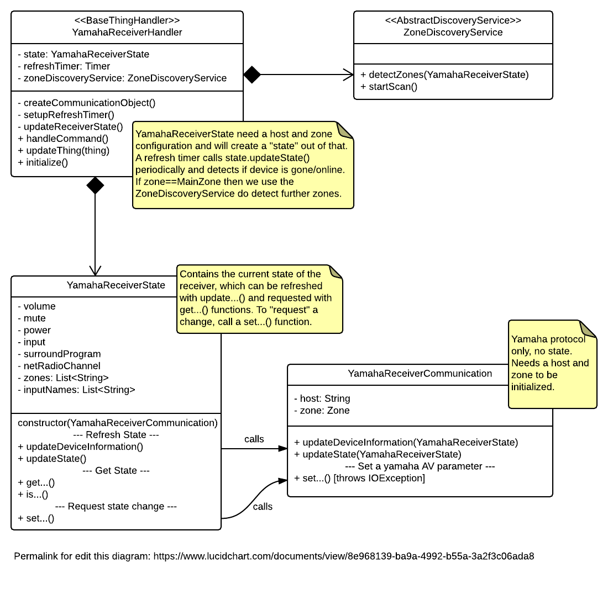
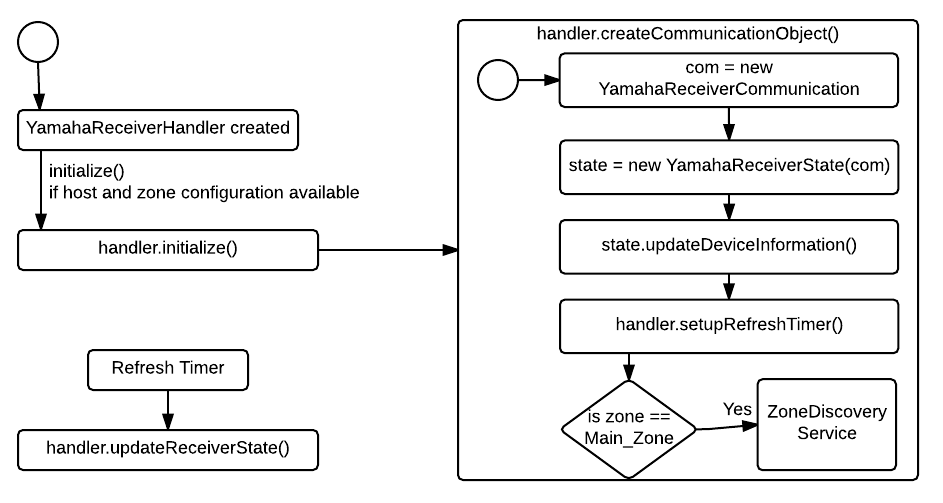

# Yamahareceiver Binding

This binding connects openhab with various Yamaha Receivers.

tested Receivers:
* V473
* V475
* V477
* V479
* V575
* V671
* V675
* V773
* V775
* RX-A1030
* RX-A1050 (Aventage)
* RX-A2020
* RX-A810
* RX-S601D
* RX-V677
* HTR-4065

Please add sucessfully tested receivers!

## Configuration

Just use the auto discovery feature or add a thing for the binding manually
by providing host and port.
Initially a thing for the main zone will be created. This will trigger a zone
detection internally and all available additional zones will appear as new things.

## Features
The implemented channels are so far:

* `power`: Openhab Type `Switch`, Switches The Receiver ON or OFF.
	Your receiver has to be in network standby for this to work.
* `mute`: Openhab Type `Switch`, Mute or Unmute the receiver
* `volume`: Openhab Type `Dimmer`, Set's the receivers Volume percent Value.
* `input`: Openhab Type `String`, Set's the input selection, depends on your receiver's real inputs.
	Examples: HDMI1, HDMI2, AV4, TUNER, NET RADIO, etc. Those names can be changed
	on the receiver. A list of available inputs is fetched internally, but there is now way to
	make that available to sitemaps at the moment.
* `surroundProgram`: Openhab Type `String`, Set's the surround Mode
	Examples: 2ch Stereo, 7ch Stereo, Hall in Munic, Straight, Surround Decoder.
	A list of available modes is already defined but is not available for sitemaps
	at the moment due to openhab2 limitations.
 
## Example

    .items

     Switch Yamaha_Power         "Power [%s]"         <tv> 
     Dimmer Yamaha_Volume         "Volume [%.1f %%]"       
     Switch Yamaha_Mute             "Mute [%s]"            
     String Yamaha_Input         "Input [%s]"              
     String Yamaha_Surround         "surround [%s]"        
     Number Yamaha_NetRadio  "Net Radio" <netRadio> 
	 
	 # You have to link the items to the channels of your prefered zone e.g. in paperui after you've saved
	 # your items file.
 
     .sitemap

     Selection item=Yamaha_NetRadio label="Sender" mappings=[1="N Joy", 2="Radio Sport", 3="RDU", 4="91ZM", 5="Hauraki"]
     Selection item=Yamaha_Input mappings=[HDMI1="BlueRay",HDMI2="Satellite","NET RADIO"="NetRadio",TUNER="Tuner"]
     Selection item=Yamaha_Surround label="Surround Mode" mappings=["2ch Stereo"="2ch","7ch Stereo"="7ch"]
	 
	 # Although mappings/options are already defined for the channels, they are not shown in the current version of openhab2.
	 # For the moment, just define mappings in your sitemap files.

Hint: The tricky thing are the `"` around `NET RADIO`, this Key (left from the equal sign) is a value that must be send to the receiver **with** the space inside. If you omit the `"` the binding sends only the `NET` and the receiver do's nothing. 
Same are in surround definition!

## Implementation
An overview is presented with the following diagram:

The control flow is visualiased here:

The YamahaReceiverCommunication class is a pure protocol implementation.
Yamaha uses a XML API. The receiver does not allow long polling or any
other type of state-update notification, therefore we use a timer for
periodically refreshing the state.

The thing handler needs a host and zone configuration that is usually
given by the discovery service (YamahaDiscoveryParticipant via UPNP).
createCommunicationObject() is called in initialize(). There we create
a communication object (YamahaReceiverCommunication) which needs the host
and zone parameters and hand it over to a newly created YamahaReceiverState.
We also setup the refresh timer.

There is a second discovery service, the ZoneDiscoveryService which is created
and used in createCommunicationObject() if we are the thing handler for the Main_Zone.
For every other zone a discovery result will be generated and can be added by the user.

## Authors
 * David Gräff <david.graeff@tu-dortmund.de>, 2016
 * Eric Thill
 * Ben Jones