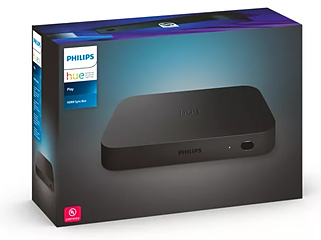

# HueSync Binding

This binding integrates the [Play HDMI Sync Box](https://www.philips-hue.com/en-us/p/hue-play-hdmi-sync-box-/046677555221) into openHAB.
The integration happens directly through the Hue [HDMI Sync Box API](https://developers.meethue.com/develop/hue-entertainment/hue-hdmi-sync-box-api/) (not via a Hue Bridge).

 


## Supported Things

_Please describe the different supported things / devices including their ThingTypeUID within this section._
_Which different types are supported, which models were tested etc.?_
_Note that it is planned to generate some part of this based on the XML files within ```src/main/resources/OH-INF/thing``` of your binding._

- `bridge`: Short description of the Bridge, if any
- `sample`: Short description of the Thing with the ThingTypeUID `sample`

## Discovery

The beinding is using [mDNS](https://en.wikipedia.org/wiki/Multicast_DNS) to discover HDMI Sync devies in the local network.
The LED on the Sync Box must be white or red.
This indicates that the device is connected to the Network.
If the LED is blinking blue, you need to setup the device using the official [Hue Sync App](https://www.philips-hue.com/en-in/explore-hue/propositions/entertainment/hue-sync).

If the device is not discovered you can check if it is properly configured and discoverable in the network:

<details>
  <summary>Linux (Ubuntu based distributions)</summary>

```bash
$ avahi-browse --resolve _huesync._tcp 
+ wlp0s20f3 IPv4 HueSyncBox-XXXXXXXXXXX                       _huesync._tcp        local
= wlp0s20f3 IPv4 HueSyncBox-XXXXXXXXXXX                       _huesync._tcp        local
   hostname = [XXXXXXXXXXX.local]
   address = [192.168.0.12]
   port = [443]
   txt = ["name=Sync Box" "devicetype=HSB1" "uniqueid=XXXXXXXXXXX" "path=/api"]
```

</details>

## Thing Configuration

To enable the binding to communicate with the device, a registration is required. 
Once the registration process is completed, the acquired token will authorize the binding to communicate with the device. 
After initial discovery and thing creation the device will stay offline.
To complete the authentication you need to pressed the registration button on the sync box for 3 seconds.

_Describe what is needed to manually configure a thing, either through the UI or via a thing-file._
_This should be mainly about its mandatory and optional configuration parameters._

_Note that it is planned to generate some part of this based on the XML files within ```src/main/resources/OH-INF/thing``` of your binding._

### Thing Configuration `huesyncthing`

| Name                 | Type    | Description                       | Default | Required | Advanced |
| -------------------- | ------- | --------------------------------- | ------- | -------- | -------- |
| host                 | text    | IP address of the device          | N/A     | yes      | no       |
| port                 | integer | Port of the HDMI Sync Box.        | 443     | yes      | yes      |
| registrationId       | text    | Application Registration Id       | N/A     | no       | yes      |
| apiAccessToken       | text    | API Access Token                  | N/A     | no       | yes      |
| statusUpdateInterval | integer | Status Update Interval in seconds | 10      | yes      | yes      |

## Channels

### Channel Group `device-firmware`

#### Firmware

Information about the installed device firmware and available updates.

| Channel            | Type   | Read/Write | Description                       |
| ------------------ | ------ | ---------- | --------------------------------- |
| firmware           | String | R          | Installed firmware version        |
| available-firmware | String | R          | Latest available firmware version |

## Full Example

_Provide a full usage example based on textual configuration files._
_*.things, *.items examples are mandatory as textual configuration is well used by many users._
_*.sitemap examples are optional._

### Thing Configuration

```java
Example thing configuration goes here.
```

### Item Configuration

```java
Group HueSyncBox "HueSyncBox" <f7:tv> ["NetworkAppliance"]

Group HueSyncBox_Firmware "Firmware" <f7:info> (HueSyncBox) ["Sensor"]

Group HueSyncBox_Inputs "Inputs" <receiver> (HueSyncBox) ["Receiver"]

Group HueSyncBox_Input_1 "Input 1" <receiver> (HueSyncBox_Inputs) ["Receiver"]
Group HueSyncBox_Input_2 "Input 2" <receiver> (HueSyncBox_Inputs) ["Receiver"]
Group HueSyncBox_Input_3 "Input 3" <receiver> (HueSyncBox_Inputs) ["Receiver"]
Group HueSyncBox_Input_4 "Input 4" <receiver> (HueSyncBox_Inputs) ["Receiver"]

Group HueSyncBox_Output "Output" <screen> (HueSyncBox) ["Screen"]

String HueSyncBox_Firmware_Version        "Firmware Version"        <f7:info> (HueSyncBox_Firmware) ["Property"]  { channel="huesync:huesyncthing:HueSyncBox:device-firmware#firmware" }           
String HueSyncBox_Latest_Firmware_Version "Latest Firmware Version" <f7:info> (HueSyncBox_Firmware) ["Property"]  { channel="huesync:huesyncthing:HueSyncBox:device-firmware#available-firmware" } 

String HueSyncBox_Device_hdmi_in1_Type    "Type - Input 1"   <f7:tag>     (HueSyncBox_Input_1) ["Property"]  { channel="huesync:huesyncthing:HueSyncBox:device-hdmi-in-1#type" }              
String HueSyncBox_Device_hdmi_in1_Name    "Name - Input 1"   <f7:textbox> (HueSyncBox_Input_1) ["Property"]  { channel="huesync:huesyncthing:HueSyncBox:device-hdmi-in-1#name" }              
String HueSyncBox_Device_hdmi_in2_Name    "Name - Input 2"   <f7:textbox> (HueSyncBox_Input_2) ["Property"]  { channel="huesync:huesyncthing:HueSyncBox:device-hdmi-in-2#name" }              
String HueSyncBox_Device_hdmi_in2_Type    "Type - Input 2"   <f7:tag>     (HueSyncBox_Input_2) ["Property"]  { channel="huesync:huesyncthing:HueSyncBox:device-hdmi-in-2#type" }              
String HueSyncBox_Device_hdmi_in3_Name    "Name - Input 3"   <f7:textbox> (HueSyncBox_Input_3) ["Property"]  { channel="huesync:huesyncthing:HueSyncBox:device-hdmi-in-3#name" }              
String HueSyncBox_Device_hdmi_in3_Type    "Type - Input 3"   <f7:tag>     (HueSyncBox_Input_3) ["Property"]  { channel="huesync:huesyncthing:HueSyncBox:device-hdmi-in-3#type" }              
String HueSyncBox_Device_hdmi_in4_Name    "Name - Input 4"   <f7:textbox> (HueSyncBox_Input_4) ["Property"]  { channel="huesync:huesyncthing:HueSyncBox:device-hdmi-in-4#name" }              
String HueSyncBox_Device_hdmi_in4_Type    "Type - Input 4"   <f7:tag>     (HueSyncBox_Input_4) ["Property"]  { channel="huesync:huesyncthing:HueSyncBox:device-hdmi-in-4#type" }             

String HueSyncBox_Device_hdmi_out_Name    "Name - Output"    <f7:textbox> (HueSyncBox_Output)  ["Property"]  { channel="huesync:huesyncthing:HueSyncBox:device-hdmi-out#name" }               
String HueSyncBox_Device_hdmi_out_Type    "Type - Output"    <f7:tag>     (HueSyncBox_Output)  ["Property"]  { channel="huesync:huesyncthing:HueSyncBox:device-hdmi-out#type" }               
```

### Sitemap Configuration

```perl
Optional Sitemap configuration goes here.
Remove this section, if not needed.
```

## Any custom content here!

_Feel free to add additional sections for whatever you think should also be mentioned about your binding!_
