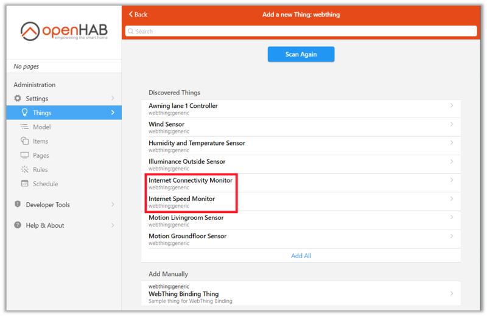
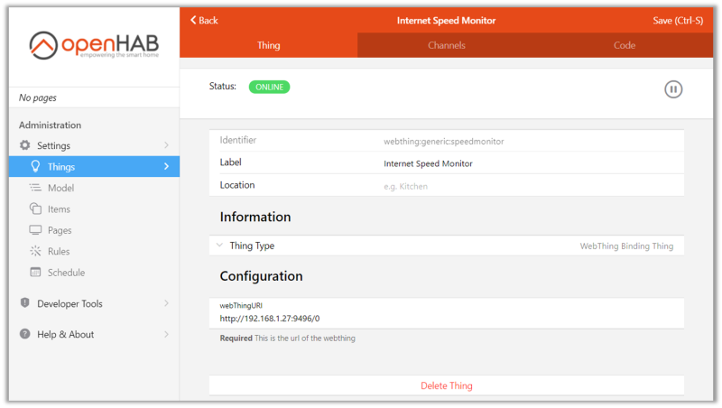
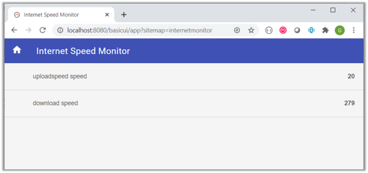

# WebThing Binding

The WebThing binding supports an interface to smart home device supporting the Web Thing API. 

The [Web Thing API](https://iot.mozilla.org/wot/) describes how smart home devices or things can be discovered and linked. 
Essentially, such smart home devices provide a Web-based API that can be used by smart home systems such as openHAB 
to monitor and control your smart home device.
These days, the Web Thing API is primarily used by makers to provide an open and common API to their physical smart home devices. 
For instance, the Web Thing API has been used by makers to provide an open way to control [LEDs on a ESP8266 board](https://github.com/WebThingsIO/webthing-arduino) 
or to monitor [a PIR motion sensor on Raspberry Pi](https://pypi.org/project/pi-pir-webthing/).

## Supported Things
As a generic solution, the WebThing binding does not depend on specific devices. All devices implementing the Web Thing API should be accessible. 
 

## Discovery
Once the binding is activated all reachable WebThing devices will be detected via mDNS, automatically.

## Binding Configuration
No binding configuration required.


## Thing Configuration

| Parameter | Description   | Required  | 
|----------|--------|-------------|
| webThingURI | the URI of the WebThing | true  |

Due to the discovery support, no manual Thing configuration is required. However, under certain circumstances textual 
Thing configuration may be preferred. In this case, the webThingURI has to be configured as shown in the webthing.things file below:
```
Thing webthing:generic:motionsensor [ webThingURI="http://192.168.1.27:9496/" ]
```

## Channels

The supported channels depend on the WebThing device that is connected. Each mappable WebThing property will be mapped to a dedicated channel. For instance, to support the *motion property* of a Motion-Sensor WebThing, a dedicated *motion channel* will be created, automatically.

| Thing | channel  | type   | description                  |
|--------|----------|--------|------------------------------|
| WebThing | Automatic | Automatic | All channels will be generated automatically based on the detected WebThing properties |

## Full Example
In the example below WebThings provided by the [Internet Monitor Service](https://pypi.org/project/internet-monitor-webthing/) will be connected. 
This service does not require specific hardware or devices. To connect the WebThings, the service has to be installed inside your local network.   


### Thing  
After installing the WebThing binding you should find the WebThings of your network in your openHAB Thing browser as shown below.
 
 

Here, the WebThings provided by the *Internet Monitor Service*: the *Internet Connectivity* WebThing as well as the 
*Internet Speed Monitor* WebThing have been discovered. To add a WebThing as an openHAB Thing click the 'Add as Thing' button. 

 

Alternatively, you may add the WebThing as a openHAB Thing by using a webthing.thing file that has to be located inside the things folder.  
```
Thing  webthing:generic:speedmonitor [ webThingURI="http://192.168.1.27:9496/0" ]
```
Please consider that the *Internet Monitor Service* in this example supports two WebThings. Both WebThings are bound on the 
same hostname and port. However, the WebThing URI path of the speed monitor ends with '/0'. In contrast, 
the connectivity WebThing URI path ends with '/1' in this example.     

Due to the fact that the WebThing API is based on web technologies, you can validate the WebThing description by opening the WebThing uri in a browser.   
 
 
 
### Items   
The *Internet Speed Monitor* WebThing used in this example supports properties such as *downloadspeed*, *uploadspeed* or *ping*. 
For each property of the WebThing a dedicated openHAB channel will be created, automatically. The channelUID such 
as *webthing:generic:speedmonitor:uploadspeed* is the combination of the thingUID *webthing:generic* and the 
WebThing property name *uploadspeed*. 

 

These channels may be linked via the channels tab of the graphical user interface or manually via a webthing.items file as shown below
 ```
Number uploadSpeed  "uploadspeed speed [%.0f]" {channel="webthing:generic:speedmonitor:uploadspeed"}
Number downloadSpeed  "download speed [%.0f]" {channel="webthing:generic:speedmonitor:downloadspeed"}

 ```
 
### Sitemap
To add the newly linked WebThing items to the sitemap you place a sitemap file such as the internetmonitor.sitemap file shown below   
```
sitemap internetmonitor label="Internet Speed Monitor" {
    Text item=uploadSpeed  
    Text item=downloadSpeed  
}
```

 